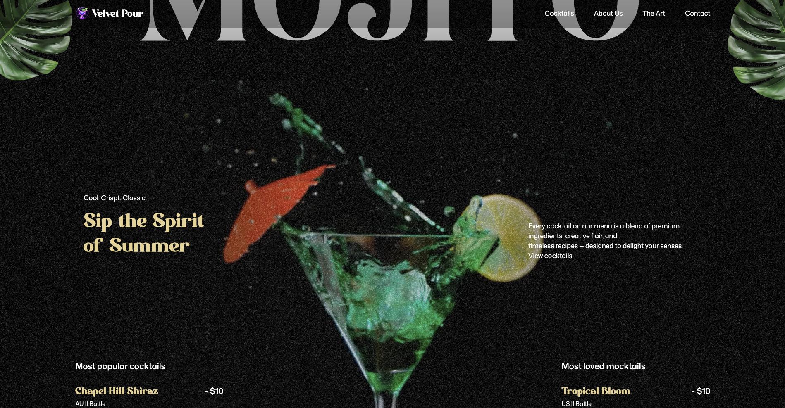

# GSAP Cocktail

A modern single-page website built with **React**, **Vite**, and **GSAP**.  
The project demonstrates advanced scroll-triggered animations, modular architecture, and best practices for building performant front-end applications.

[](https://gsapcocktail.netlify.app "Open the live demo")

**Live Demo**: [https://gsapcocktail.netlify.app](https://gsapcocktail.netlify.app)
---

## Overview

This repository was created to explore how **GSAP** can be integrated into a **React + Vite** workflow.  
Animations are structured in a reusable and modular way, separating concerns between UI components and animation logic.  

The site is deployed using **Netlify**, with automated builds configured via `netlify.toml`.

---

## Technical Stack

- **React 18** – Component-based UI development  
- **Vite** – Development server and build tool for optimized production output  
- **GSAP 3** – High-performance JavaScript animation library  
- **ScrollTrigger** – GSAP plugin for scroll-based interactions  
- **ESLint** – Code linting and style consistency (`eslint.config.js`)  
- **Netlify** – Hosting and CI/CD for automatic deployment  
- **CSS3** – Styling with modern layout techniques (Flexbox & Grid)

---

## Project Structure

```
├── constants/              # Application constants (data, configuration, etc.)
├── dist/                   # Production build output (generated by Vite)
├── public/                 # Static public assets (served as-is)
├── src/
│   ├── components/         # React components
│   │   ├── About.jsx
│   │   ├── Art.jsx
│   │   ├── Cocktails.jsx
│   │   ├── Contact.jsx
│   │   ├── Hero.jsx
│   │   ├── Menu.jsx
│   │   └── Navbar.jsx
│   ├── App.jsx             # Root application component
│   ├── index.css           # Global stylesheet
│   └── main.jsx            # React entry point
├── .gitignore
├── eslint.config.js        # ESLint configuration
├── index.html              # HTML entry point
├── netlify.toml            # Netlify deployment configuration
├── package.json
├── package-lock.json
├── vite.config.js          # Vite configuration
└── README.md
```

---

## Development

Clone the repository:

```bash
git clone https://github.com/bkaratas/gsap_website.git
cd gsap_website
```

Install dependencies:

```bash
npm install
```

Run development server:

```bash
npm run dev
```

Build for production:

```bash
npm run build
```

Preview production build:

```bash
npm run preview
```

---

## Deployment

The project is continuously deployed on **Netlify**.  
Configuration is handled via `netlify.toml`.

Each push to the `main` branch triggers:

```bash
npm run build
```

The generated `dist/` directory is automatically published.

SPA fallback is configured using a `_redirects` file:

```
/*   /index.html   200
```

---

## Contributing

Contributions and improvements are welcome.  
Please fork the repository and create a pull request with your proposed changes.

---

